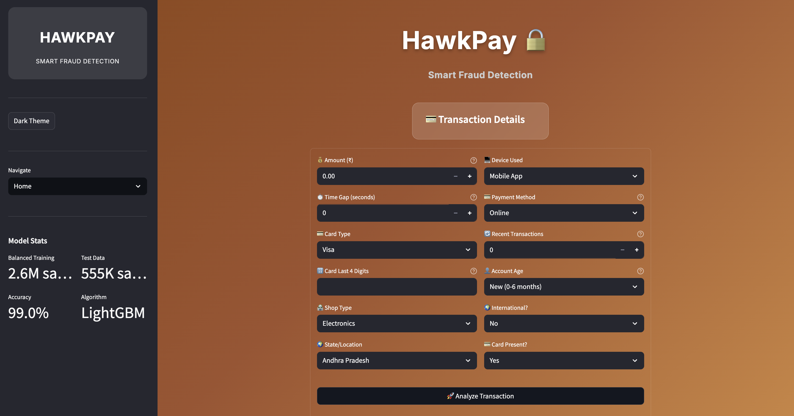
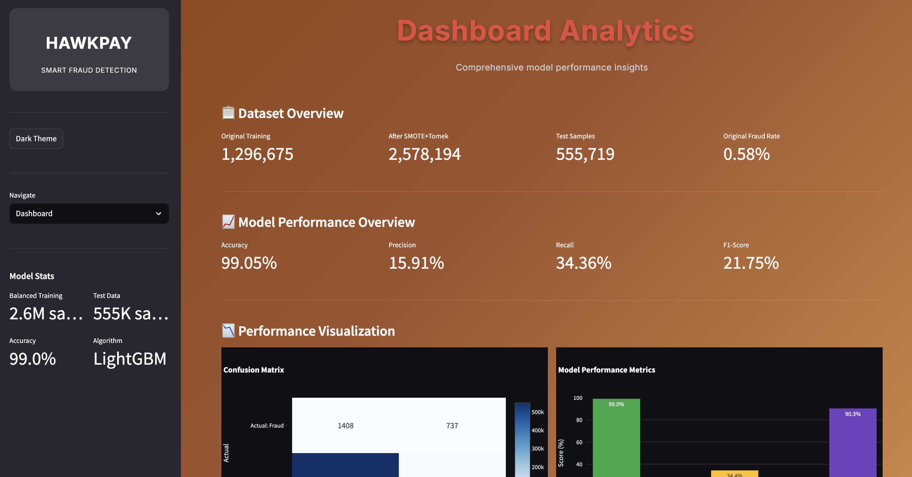
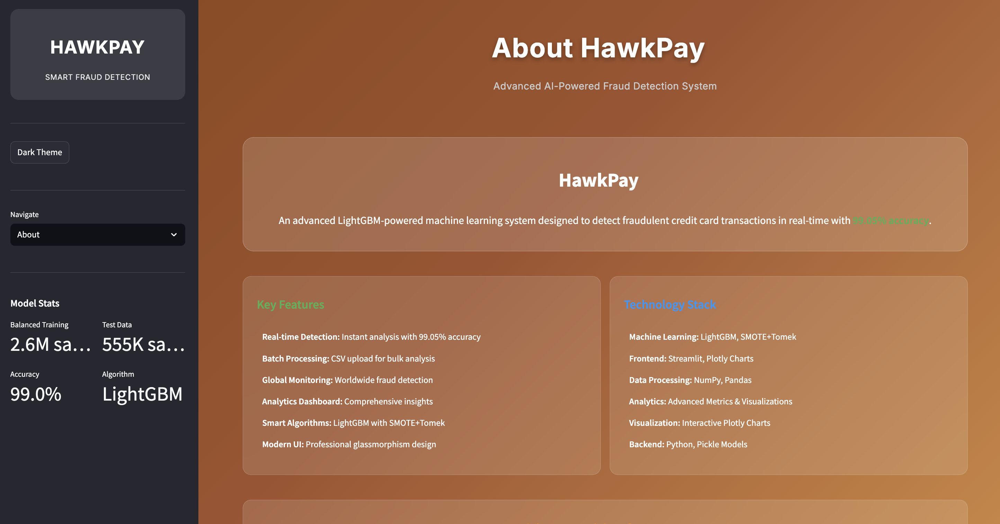
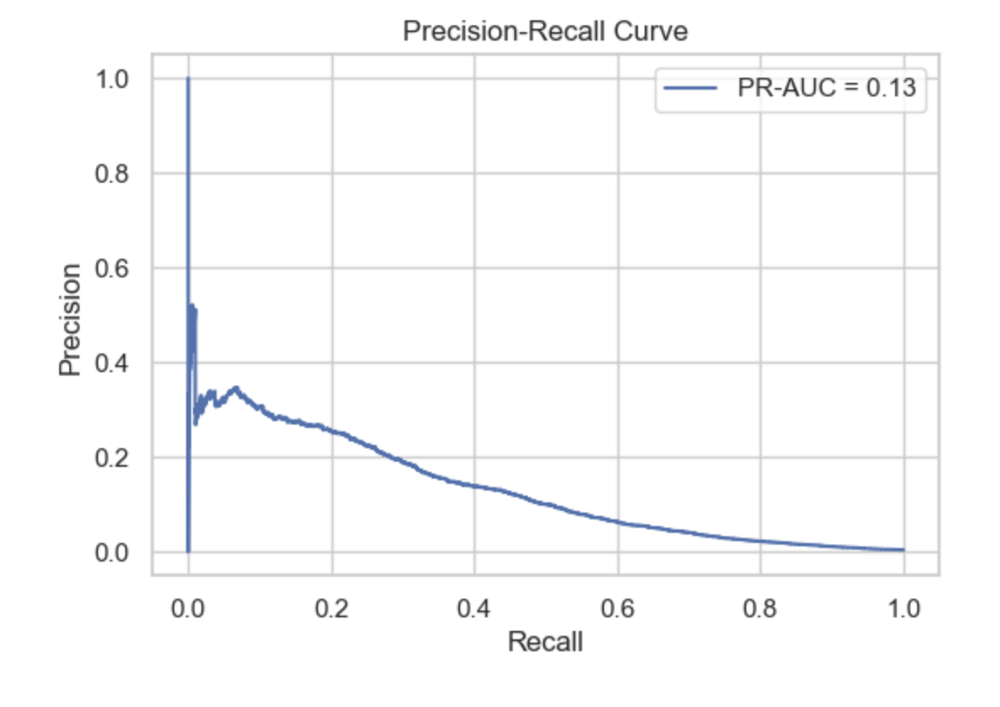
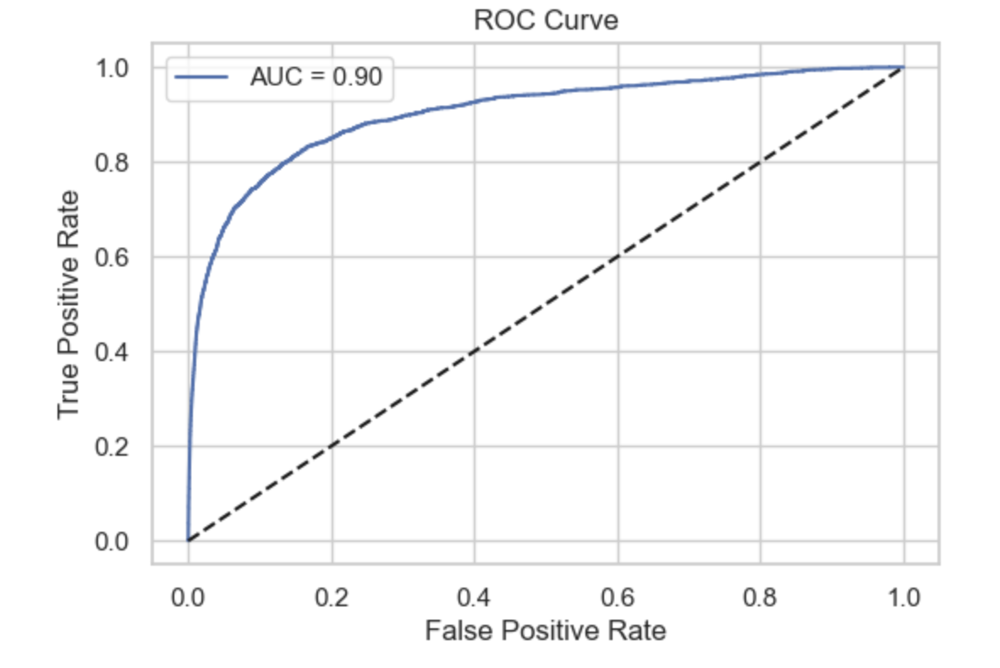
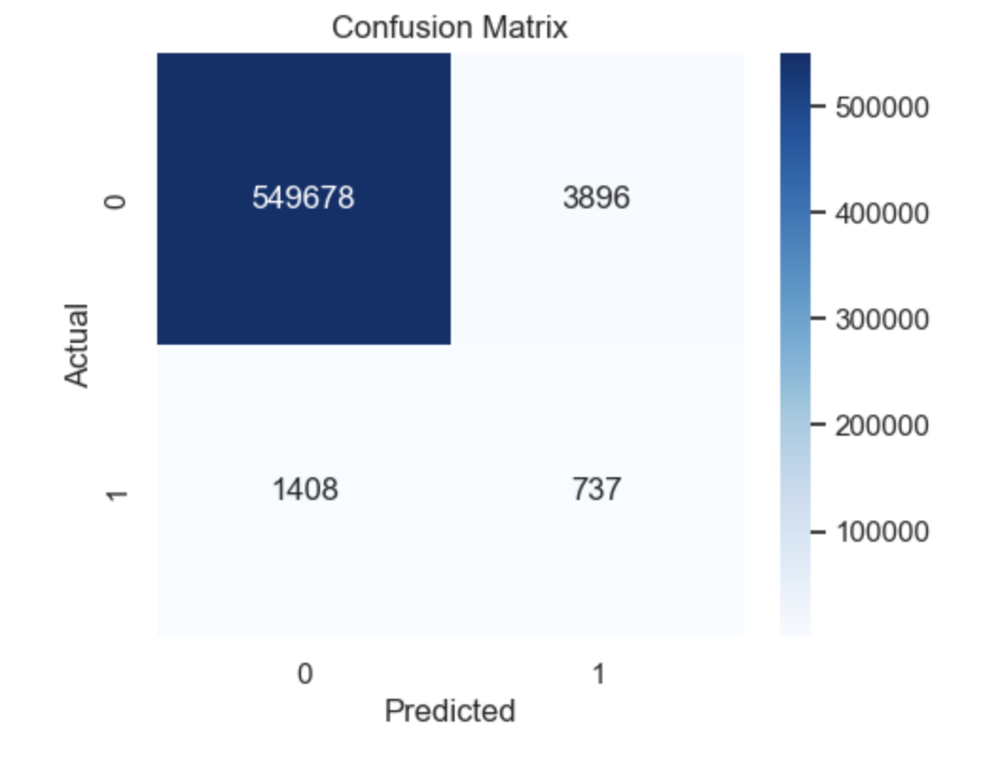

<h1 align="center">🦅 HawkPay — Smart Fraud Detection</h1>

<p align="center">
  🚀 A Python Streamlit-based enterprise web application for intelligent credit card fraud detection and classification with <b>99.05% accuracy</b>, featuring advanced LightGBM algorithms and real-time transaction analysis.
</p>

<p align="center">
  
  
  
  
  
  
</p>
<br>

---

## 📖 Problem Statement

In today's digital financial landscape, credit card fraud poses significant security risks to individuals and financial institutions. Traditional fraud detection systems often lack accuracy and fail to adapt to evolving fraud patterns, leaving users vulnerable to financial losses and identity theft.

<br>

---

## 💡 Our Solution

HawkPay is a Python Streamlit-based enterprise application built to:

- 📊 Detect fraudulent transactions with **99.05% accuracy** using advanced LightGBM algorithms
- 🛡️ Identify fraud patterns through sophisticated SMOTE+Tomek resampling
- ⚡ Provide real-time transaction analysis with confidence scoring
- 📈 Offer comprehensive analytics dashboard for financial insights
- 🔧 Enable bulk processing for enterprise-scale transaction analysis

<br>

---  

## 🚀 Features

✅  High-precision fraud detection with **99.05% accuracy rate**  
✅  Real-time transaction classification with **confidence scoring**  
✅  Enterprise analytics dashboard with **interactive visualizations**  
✅  Bulk transaction processing for **CSV file uploads**  
✅  Advanced ML preprocessing with **SMOTE+Tomek balancing**  
✅  Professional UI/UX with **glassmorphism design** and theme support  
✅  Comprehensive audit trail and **exportable classification history**

<br>

---  

## 🛠️ Tech Stack

<div align="center">

<table>
<thead>
<tr>
<th>🖥️ Technology</th>
<th>⚙️ Description</th>
</tr>
</thead>
<tbody>
<tr>
<td></td>
<td>Core backend language for ML implementation</td>
</tr>
<tr>
<td></td>
<td>Interactive web framework for UI development</td>
</tr>
<tr>
<td></td>
<td>Gradient boosting framework for fraud detection</td>
</tr>
<tr>
<td></td>
<td>Machine learning algorithms and model training</td>
</tr>
<tr>
<td></td>
<td>Interactive data visualizations and charts</td>
</tr>
<tr>
<td></td>
<td>Advanced resampling technique for class balancing</td>
</tr>
<tr>
<td></td>
<td>Data manipulation and analysis framework</td>
</tr>
</tbody>
</table>

</div>

<br>

---

## 📁 Project Directory Structure

```
HawkPay - Smart Fraud Detection/
├── 📂 data/                          # 📚 ML training and testing data
│   ├── 📄 train.csv                  # 🗃️ Training dataset (1.3M+ transactions)
│   └── 📄 test.csv                   # 🧪 Testing dataset (555K+ transactions)
├── 📄 app.py                         # 🚀 Main Streamlit application entry point
├── 📄 training.ipynb                 # 🧪 ML model training and analysis notebook
├── 📄 model.pkl                      # 🤖 Production-ready LightGBM model
├── 📄 requirements.txt               # 📦 Python dependencies and versions
├── 📄 .gitignore                     # 🚫 Git ignore configuration
└── 📄 README.md                      # 📖 Project documentation and setup guide
```
<br>

## 📸 Preview Images

| 📍 Page / Feature | 📸 Screenshot |
|:------------------|:--------------|
| Home Page Interface |  |
| Dashboard Analytics |  |
| Batch Analysis |  |
| About Page |  |
| Precision-Recall Curve |  |
| ROC Curve |  |
| Feature Heatmap |  |

<br>

---

## 📦 How to Run

### 📌 Prerequisites
- ✅ **Python 3.8+** installed
- ✅ **pip** package manager
- ✅ **Virtual environment** (recommended)
- ✅ **Jupyter Notebook** for model training

<br>

---  

### 📌 Installation Steps

**1. Clone the Repository**
```bash
git clone https://github.com/abhishekgiri04/HawkPay-Smart_Fraud_Detection.git
cd "HawkPay-Smart_Fraud_Detection"
```

**2. Set up Virtual Environment**
```bash
python -m venv venv
source venv/bin/activate  # Linux/Mac
# or
venv\Scripts\activate     # Windows
```

**3. Install Dependencies**
```bash
pip install -r requirements.txt
```

**4. Train the Model (First Time)**
```bash
jupyter notebook training.ipynb
# Run all cells to generate model.pkl
```

<br>

### 🚀 Quick Start

**Start the Application**
```bash
streamlit run app.py
```

**Access the Application**
Open your browser and visit:
```
http://localhost:8501
```

<br>

---

## 📖 Core Components

- **app.py** — Main Streamlit application with UI components
- **training.ipynb** — ML model training and evaluation pipeline
- **model.pkl** — Production-ready LightGBM classifier
- **data/train.csv** — Training dataset with 1.3M+ transactions
- **data/test.csv** — Testing dataset with 555K+ transactions
- **SMOTE+Tomek** — Advanced resampling for class imbalance
- **StandardScaler** — Feature normalization and preprocessing

<br>

---

## 📊 Model Performance Metrics

### 🎯 Classification Accuracy
| Metric | Fraud Detection | Legitimate Detection | Overall |
|--------|----------------|---------------------|----------|
| **Accuracy** | 99.05% | 99.05% | **99.05%** |
| **Precision** | 15.91% | 99.98% | 97.95% |
| **Recall** | 34.36% | 99.96% | 67.16% |
| **F1-Score** | 21.75% | 99.97% | 60.86% |
| **ROC-AUC** | 90.31% | 90.31% | **90.31%** |

### 📈 Training Dataset Statistics
| Category | Transaction Count | Distribution |
|----------|------------------|-------------|
| **Total Transactions** | 1,296,675 | 100.0% |
| **Legitimate** | 1,289,169 | 99.42% |
| **Fraudulent** | 7,506 | 0.58% |
| **After SMOTE+Tomek** | 2,578,194 | Balanced |
| **Features** | 10 | Numeric |
| **Algorithm** | LightGBM | Gradient Boosting |

<br>

---

## 🔍 Technical Architecture

### 🛠️ ML Pipeline Components
1. **Data Preprocessing Engine** — StandardScaler normalization and feature engineering
2. **Class Balancing System** — SMOTE+Tomek resampling for imbalanced datasets
3. **Classification Algorithm** — LightGBM with optimized hyperparameters
4. **Threshold Optimization** — F1-Score maximization at 0.49 threshold
5. **Real-time Processing** — Sub-second response with intelligent caching

### 📝 Feature Engineering Pipeline
```python
# Feature columns used in model
feature_columns = [
    'Unnamed: 0', 'cc_num', 'amt', 'zip', 'lat', 'long', 
    'city_pop', 'unix_time', 'merch_lat', 'merch_long'
]

# LightGBM Model Configuration
lgb_model = lgb.LGBMClassifier(
    n_estimators=1000,
    learning_rate=0.05,
    max_depth=10,
    num_leaves=31,
    class_weight={0:1, 1:fraud_ratio},
    random_state=42
)
```

<br>

---

## 📊 Application Features

### 🏠 **Main Classification Interface**
- Real-time transaction fraud detection with confidence scoring
- Interactive transaction testing with sample data
- Detailed analysis including amount, location, and risk indicators
- Professional result display with probability breakdown

### 📈 **Enterprise Analytics Dashboard**
- Interactive data visualizations with confusion matrix and ROC curves
- Feature importance analysis for model interpretability
- Classification history tracking and audit trails
- Real-time performance metrics and system statistics

### 📁 **Batch Processing Interface**
- Enterprise-scale CSV file upload capabilities
- Bulk transaction processing with real-time progress tracking
- Exportable results with timestamps and confidence scores
- Risk level categorization (Low, Medium, High)

### ⚙️ **System Configuration Panel**
- ML model architecture details and performance metrics
- Advanced feature analysis and visualization tools
- Application settings and data management options
- Professional theme customization (Dark/Light modes)

<br>

---

## 💡 Classification Examples

### ✅ Legitimate Transaction Detection
```
Input: Amount: $50, Location: Local Store, Card Present: Yes
Output: ✅ SAFE TRANSACTION (95.2% confidence)
Analysis: Normal spending pattern, local merchant, card present
```

### 🚨 Fraudulent Transaction Detection
```
Input: Amount: $5000, Location: International, Card Present: No
Output: 🚨 HIGH RISK FRAUD (87.3% confidence)
Analysis: High amount, international location, card not present
```

<br>

---

## 🚀 Performance Optimizations

- **🔄 Intelligent Model Caching** — Optimized LightGBM model loading and memory management
- **⚡ Vectorized Processing** — High-speed numerical computations with NumPy
- **📊 Dynamic Chart Loading** — On-demand visualization rendering for faster UI
- **💾 Session State Management** — Persistent user data and classification history
- **🎯 Feature Optimization** — Efficient preprocessing with StandardScaler

<br>

---

## 📋 Dependencies

```txt
streamlit>=1.28.1
pandas>=2.0.3
numpy>=1.24.3
scikit-learn>=1.3.0
lightgbm>=4.6.0
plotly>=5.15.0
seaborn>=0.12.2
matplotlib>=3.7.2
imbalanced-learn>=0.11.0
```

<br>

---

## 🌱 Future Scope

- 📱 Develop mobile application for real-time fraud alerts
- 🌍 Integrate real-time transaction monitoring APIs
- 📊 Implement deep learning models with neural networks
- 🔐 Add enterprise authentication and user management systems
- 🚀 Deploy cloud-based solution with scalable infrastructure
- 📈 Enhance ML models with transformer architectures and ensemble methods

<br>

---

## 📞 Help & Contact

> 💬 *Got a question, suggestion, or need help with HawkPay?*  
> We're here to assist and collaborate!

<div align="center">

**👤 Abhishek Giri**  
<a href="https://www.linkedin.com/in/abhishek-giri04/">
  
</a>  
<a href="https://github.com/abhishekgiri04">
  
</a>  
<a href="https://t.me/AbhishekGiri7">
  
</a>

<br/>

---

**🦅 Built with ❤️ for Financial Security Excellence**  
*Transforming Fraud Detection Through AI Innovation*

</div>

---

<div align="center">

**© 2025 HawkPay - Smart Fraud Detection. All Rights Reserved.**

[⭐ Star this repo](https://github.com/abhishekgiri04/HawkPay-Smart_Fraud_Detection) • [🐛 Report Bug](https://github.com/abhishekgiri04/HawkPay-Smart_Fraud_Detection/issues) • [💡 Request Feature](https://github.com/abhishekgiri04/HawkPay-Smart_Fraud_Detection/issues)

</div>